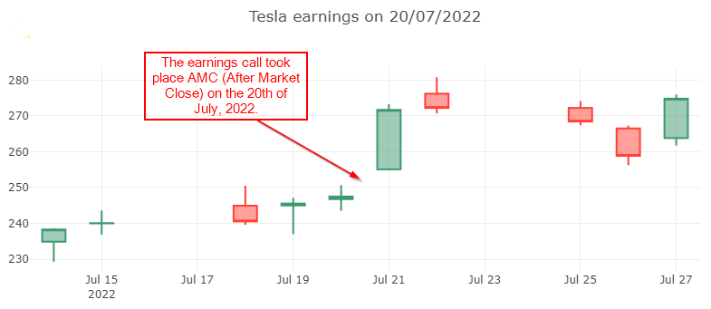

# CosminSanda.Finance


[](https://coveralls.io/github/cosmincatalin/finance-library?branch=master)

This package simplifies the process of retrieving data from Yahoo Finance.  
Currently, it can fetch information about earnings calls and about daily quotes.

This package can be used, typically, to analyze the price action around historical earnings calls for the purpose
of establishing strategies for future earnings releases a.k.a "Playing the Earnings".

The package acts as a proxy to Yahoo Finance and is essentially a web scraper.  
While in previous versions, caching was built in, it has been removed.  
That means all methods make requests directly to Yahoo Finance and it is your responsibility to cache the data so as to avoid redundant requests.  
The reason for disabling the cache has to do with the lack of guarantees regarding the provided data which can lead to inconsistencies for less popular instruments.

Methods are made static to make it easier to use from interactive environments.  
That is also the reason why there aren't a lot of options for Dependencies Injection of, for example, logging.  
To further simplify the use of methods in the package, arguments are passed using basic types like `string` and `int32`.

## Installation

 * #### Classic
    If you would like to use this library in your own project, use the standard installation process. of packages from NuGet.

    ```bash
    Install-Package CosminSanda.Finance
    ```

 * #### Notebook
    If you would like to use this in a .NET enabled Jupyter notebook use this command in a cell:

    ```
    #r "nuget,CosminSanda.Finance"
    ```

## Sample usage

## Tesla earnings

The code blocks in this tutorials should be executed as part of a `dotnet-interactive` notebook.

In this example, we look at the price action before and after the last Tesla earnings. The number of days analyzed is always even, the first half of the days are from before the earnings call and the reminder are from after the earnings results have been released.


Although `CsvHelper` and `ServiceStack.Text` should be installed as transient dependencies, they are not, so in the notebook, they have to be installed individually.

```csharp
#r "nuget: CosminSanda.Finance"
#r "nuget: XPlot.Plotly.Interactive"
#r "nuget: CsvHelper"
#r "nuget: ServiceStack.Text"
```

Get an ascending ordered list of all Tesla earnings dates.

```csharp
var earnings = await EarningsCalendar.GetPastEarningsDates("TSLA");
```

We'll exemplify using just the latest earnings call date.

```csharp
var lastDate = earnings.Last();
```

Get the OHLC data for 5 days before and 5 days after the earnings call.  
The earnings call can take place before market open (in which case the date of the earnings call is included in the last 5 days) or after market close (in which case the date of the earnings call is included in the first 5 days).

```csharp
var quotes = await Quotes.GetQuotesAround("TSLA", lastDate, 5);
```

Use a charting library to vizualise the data and get a feel of how the earnings call expectations and actual results influence the price action.

In the case of the Tesla earnings release on 20th of July 2022, it's obvious that the call happened after market close, so the 20th is part of the "before earnings" half of the candles.

```csharp
var chart = Chart
    .Candlestick(quotes.Select(o => new Tuple<string, double, double, double, double>(
        o.Date.ToDateTime(TimeOnly.Parse("10:00 PM")).ToString("yyyy-MM-dd"),
        o.Open,
        o.High,
        o.Low,
        o.Close
    )));
chart.WithLayout(new Layout.Layout{
    title=$"Tesla earnings on {lastDate.Date}"
});
chart
```

You should see something similar to this:

