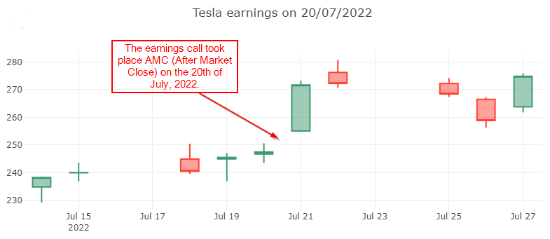

## Tesla earnings

The code blocks in this tutorials should be executed as part of a `dotnet-interactive` notebook.  

In this example, we look at the price action before and after the last Tesla earnings. The number of days analyzed is always even, the first half of the days are from before the earnings call and the reminder are from after the earnings results have been released.


Although `CsvHelper` and `ServiceStack.Text` should be installed as transient dependencies, they are not, so in the notebook, they have to be installed individually.

```csharp
#r "nuget: CosminSanda.Finance"
#r "nuget: XPlot.Plotly.Interactive"
#r "nuget: CsvHelper"
#r "nuget: ServiceStack.Text"
```

Get an asceding ordered list of all Tesla earnings dates.  

```csharp
var earnings = await EarningsCalendar.GetPastEarningsDates("TSLA");
```

We'll exemplify using just the latest earnings call date.

```csharp
var lastDate = earnings.Last();
```

Get the OHLC data for 5 days before and 5 days after the earnings call.  
The earnings call can take place before market open (in which case the date of the earnings call is included in the last 5 days) or after market close (in which case the date of the earnings call is included in the first 5 days).

```csharp
var quotes = await Quotes.GetQuotesAround("TSLA", lastDate, 5);
```

Use a charting library to vizualise the data and get a feel of how the earnings call expectations and actual results influence the price action.

In the case of the Tesla earnings release on 20th of July 2022, it's obvious that the call happened after market close, so the 20th is part of the "before earnings" half of the cancles.

```csharp
var chart = Chart
    .Candlestick(quotes.Select(o => new Tuple<string, double, double, double, double>(
        o.Date.ToDateTime(TimeOnly.Parse("10:00 PM")).ToString("yyyy-MM-dd"),
        o.Open,
        o.High,
        o.Low,
        o.Close
    )));
chart.WithLayout(new Layout.Layout{
    title=$"Tesla earnings on {lastDate.Date}"
});
chart
```

You should see something similar to this:

